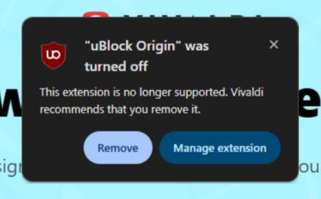

## 🌐 Introdução: A Crise da Navegação Web e o Desejo por Soberania

Vivemos na era do hiperconectado, onde a internet não é apenas uma ferramenta de comunicação, mas um ecossistema complexo, e cada canto dele está sendo mapeado. O preço dessa conveniência digital é alto: nossa privacidade. Os grandes motores de busca e os gigantes da tecnologia operam sob o manto da "otimização do usuário", mas na prática, estão construindo uma rede de vigilância sem precedentes.

Diante desse cenário, a navegação web deixou de ser um ato neutro; tornou-se um **ato político**. O usuário moderno não busca apenas navegar por páginas; ele busca soberania digital. É nesse contexto que navegadores como [Vivaldi](https://vivaldi.com/pt-br/ "Vivaldi") e [Zen Browser](https://zen-browser.app/ "Zen Browser") surgem, não apenas como *softwares*, mas como verdadeiros atos de resistência contra o rastreamento incessante.

Mas, com tantas alternativas no mercado, qual delas realmente oferece um refúgio seguro? Este guia completo mergulha nas arquiteturas desses dois gigantes da privacidade para ajudar você a escolher seu escudo digital ideal.

## 🛡️ Vivaldi Browser: O Arquivista do Controle Máximo

O Vivaldi sempre foi celebrado por uma coisa: **o controle**. Ele não apenas permite que o usuário navegue; ele exige que o usuário *configure* como navegar. Sua filosofia é devolver ao poder do navegador algo que os motores mais fechados (como o Chromium) tendem a absorver: a personalização extrema.

Para quem valoriza um painel de comando, Vivaldi é imbatível. Ele oferece recursos avançados — desde gerenciadores de abas complexos até painéis laterais totalmente customizáveis — transformando-o em uma verdadeira central de produtividade. É o navegador para o *power user* que não aceita atalhos e quer cada pixel sob seu comando.

No entanto, essa força tem um ponto cego: sua dependência do motor Chromium. E é justamente aí que reside a tensão narrativa mais importante. O ecossistema Chromium está passando por mudanças constantes (como as diretrizes MV2), forçando os navegadores a se adaptarem a padrões cada vez mais restritivos. Para o usuário de Vivaldi, isso significa estar sempre em um estado de alerta: ele é poderoso e flexível, mas também vulnerável às grandes correntes do mercado que tenta padronizar a experiência web.

## ✨ Zen Browser: A Evolução da Privacidade com Fluxo Moderno

Se o Vivaldi representa o controle manual, o Zen Browser (e sua base no motor Gecko/Firefox) representa a **evolução fluida**. Ele é construído sobre uma fundação de privacidade robusta e comprovada — o Firefox.

O Zen não tenta apenas replicar recursos; ele busca otimizar o *fluxo* de trabalho. Se você se sente sobrecarregado pela quantidade de ferramentas em um único lugar, a abordagem do Zen pode ser libertadora. Ele combina a segurança inerente ao Gecko com funcionalidades modernas como Workspaces e Split View, permitindo que o usuário mantenha múltiplas tarefas visíveis sem sacrificar a privacidade ou a estética minimalista.

O Zen Browser apela para quem está cansado de *configurar* demais e prefere um sistema que simplesmente **funcione bem** em segundo plano, protegendo os dados enquanto mantém uma interface limpa e focada na tarefa principal. É o equilíbrio entre poder e simplicidade.

## ⚖️ Vivaldi vs. Zen: O Confronto das Filosofias de Navegação

A escolha entre estes dois navegadores não é apenas técnica; ela é filosófica. Trata-se de decidir se você prefere **Controle Absoluto** ou **Privacidade Fluida**.

Para ajudar nessa decisão, compilamos um comparativo técnico detalhado:

| Característica                | Vivaldi Browser                                                  | Zen Browser                                                                    |
| :---------------------------- | :--------------------------------------------------------------- | :----------------------------------------------------------------------------- |
| **Motor Base**                | Chromium (Google)                                                | Gecko (Firefox)                                                                |
| **Filosofia Central**         | Customização e Controle Máximo, Privacidade.                     | Privacidade, Minimalismo e Fluxo de Trabalho.                                  |
| **Vantagem em Segurança**     | Alto nível de controle do usuário sobre cada recurso.            | Herda patches rápidos do Firefox; Proteção Contra Rastreamento nativa (Gecko). |
| **Recursos de Produtividade** | Painel lateral, gerenciadores avançados e recursos *power user*. | Workspaces, Split View, Glance (excelente para multitarefa focada).            |
| **Limitação Crítica**         | Vulnerável às mudanças do ecossistema Chromium.                  | Pode ter consumo elevado de RAM; Não possui suporte DRM nativo.                |
| **Curva de Aprendizado**      | Média/Alta (Exige tempo para dominar todos os recursos).         | Média (Intuitivo em termos de fluxo, mas exige adaptação ao minimalismo).      |

### Análise Detalhada dos Pontos Chave:

*   **O Motor:** A diferença entre Chromium e Gecko é o cerne do debate. O Vivaldi está ligado a um motor que, embora poderoso, tem raízes no ecossistema Google. Já o Zen Browser se apoia no Gecko (Firefox), historicamente mais resistente às pressões de padronização corporativa, sendo este seu maior trunfo em termos de privacidade.
*   **O Foco:** Se você é um arquivista digital que precisa de 15 janelas abertas e quer organizar cada aba com etiquetas coloridas e painéis laterais complexos, o Vivaldi fala a sua língua. Se você trabalha com projetos que exigem alternar rapidamente entre documentos, código e pesquisa sem perder o foco, o Zen Browser é mais adequado ao seu ritmo de trabalho.

## 🧭 Conclusão: Qual Navegador Escolher?

Não existe um vencedor absoluto; há apenas o navegador que melhor se alinha à sua necessidade momentânea. A escolha deve ser guiada por uma pergunta simples: **O que me preocupa mais hoje, a perda de controle ou a invasão da privacidade?**

*   **Escolha Vivaldi se:** Você é um usuário avançado (power user) que valoriza o máximo nível de customização e está disposto a investir tempo para dominar todas as suas ferramentas.
*   **Escolha Zen Browser se:** Sua prioridade máxima é a segurança da informação, você busca um fluxo de trabalho limpo e moderno, e prefere uma experiência mais integrada em vez de um painel de controle gigantesco.

Em última análise, tanto o Vivaldi quanto o Zen Browser nos lembram que navegar na web não pode ser passivo. É preciso estar atento, é preciso resistir à superficialidade do clique automático. Eles são ferramentas poderosas para quem entende que a verdadeira liberdade digital começa com a escolha consciente de onde se pisa na rede.

---

## ⚠️ Adendo Crítico: As Limitações do Mercado e os Custos da Privacidade (DRM e MV2)

É fundamental que o leitor entenda que, mesmo em seus momentos de resistência, tanto Vivaldi quanto Zen Browser operam dentro das regras — e pressões — impostas pelo ecossistema web. Duas limitações merecem atenção especial: a pressão do motor Chromium e a questão comercial do DRM.

### 1. A Pressão da Padronização (O Caso MV2)

A história de Vivaldi é um exemplo perfeito dessa tensão. O desenvolvimento dos navegadores não é puramente técnico; ele é moldado por interesses comerciais gigantescos. As mudanças impostas pelo Google, como as diretrizes **Manifest V3 (MV2)** para extensões, representam uma tentativa de padronizar e, em muitos casos, limitar a funcionalidade que os usuários avançados dependem.

Essa pressão corporativa força navegadores independentes a um estado constante de alerta. O fato de o Vivaldi ter enfrentado avisos sobre essas mudanças (como documentado em discussões como esta: [Google com relação ao MV2](https://www.reddit.com/r/vivaldibrowser/comments/1um5zhh/updated_to_latest_stable_vivaldis_killing_mv2/)) ilustra que a batalha não é apenas entre navegadores, mas entre o **desejo de liberdade do usuário e o poder da padronização corporativa**.

### 2. A Barreira Comercial: O Suporte DRM

Por outro lado, há as barreiras comerciais como o Digital Rights Management (DRM). Quando falamos em serviços de streaming como Netflix ou Spotify, estamos falando de conteúdo protegido por direitos autorais que exigem uma licença específica para decodificação e reprodução — a **Widevine**.

O Zen Browser, ao se apoiar no motor Gecko/Firefox, herda o excelente *core* de segurança do Firefox, mas ele não recebe automaticamente as licenças comerciais da Mozilla. O suporte DRM é um componente pago ou licenciado que deve ser adquirido separadamente pelos desenvolvedores. Portanto, a ausência de Widevine não é uma falha técnica de privacidade; é uma **limitação comercial** que impede o uso desses serviços em plataformas protegidas por direitos autorais.

Em resumo: Vivaldi luta contra as regras do motor (Chromium/MV2), e Zen Browser lida com as barreiras das licenças comerciais (DRM). Ambos são atos de resistência, mas cada um enfrenta uma frente de batalha diferente.